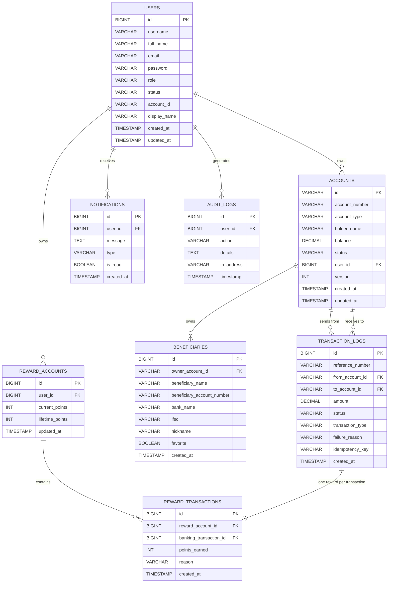

# Banking Database Schema

## ER Diagram

## Reward Rules

- Reward points are generated only when:
  - `status = 'SUCCESS'`
  - sender and receiver belong to different users
  - `amount >= 100`
- Calculation: `points = floor(amount / 100)`
- Reward history is maintained in `reward_transactions`
- A unique constraint on `banking_transaction_id` ensures rewards are generated once per transaction.

## SQL Schema Summary

The migration script `src/main/resources/db/migration/V1__bank_schema.sql` creates:

- `users`
- `accounts`
- `transaction_logs`
- `beneficiaries`
- `reward_accounts`
- `reward_transactions`
- `notifications`
- `audit_logs`

## Production migration strategy

- Flyway is enabled via `spring.flyway.enabled=true`
- Hibernate DDL auto is disabled with `spring.jpa.hibernate.ddl-auto=none`
- Migrations are applied from `classpath:db/migration`
- `spring.flyway.baseline-on-migrate=true` is enabled to support existing schema baselining
